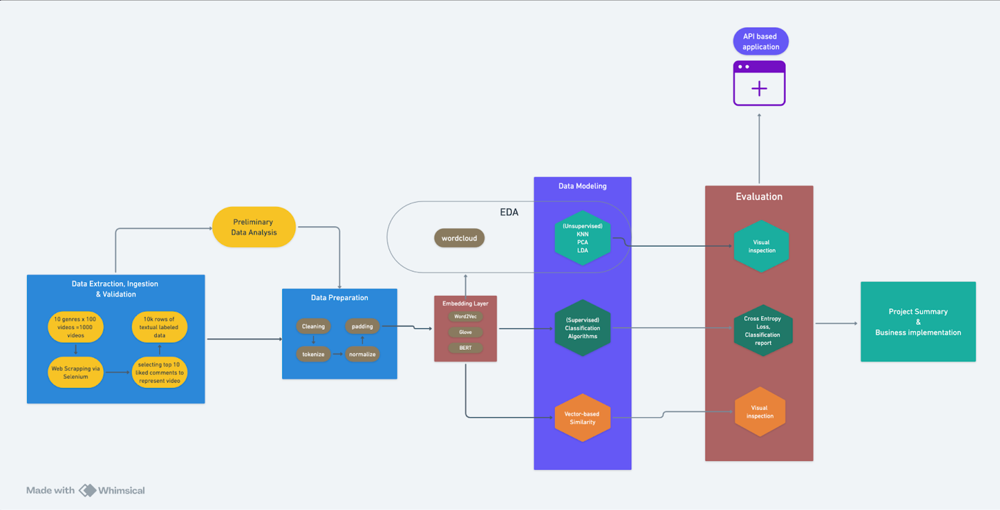

# YouTube Comment Analyzer: Analyzing Comments for Genre Classification

This repository contains the resources and documentation for a pipeline focused on scraping more than 20000 comments from 4 different genres containing 5 sub-genres each.
| Genre       | Keywords                                                                                   |
|-------------|--------------------------------------------------------------------------------------------|
| Sports      | Football compilations, hockey compilations, cricket compilations, athletics top moments, tennis top moments |
| Documentary | Nature documentaries, History documentaries, Science documentaries, True crime documentaries, Technology documentaries |
| Movie       | The Ultimate 2024 Oscar Trailers, Action movie trailers, 21st century best movies, Marvel movie trailers, Netflix original series |
| Lo-fi       | Lo-fi hip-hop beats, Lo-fi chillhop mixes, Lo-fi study music, Lo-fi jazz playlists, Lo-fi ambient music |

## Table of Contents
- [Project Overview](#project-overview)
- [Dependencies](#dependencies)
- [Project Pipeline](#project-pipeline)
- [Procedure](#procedure)
- [Business Value and Insights](#business-value-and-insights)
- [Contributing](#contributing)

## Project Overview
Youtube has a sophisticated recommender system to find the most similar videos but they don't use the textual data from their comments section in their recommendation algorithm. The idea here is to project Youtube videos from different genres onto a vector space using their comment section data using various
methods of word embedding and try to see if similar videos are clustered together based on their comments. 

Since we are going to be performing NLP tasks, we will also be exploring the world of word embeddings. We will discuss in detail about two specific embedding algorithms - word2vec and doc2vec and how each performs in this specific case. We aim to use the best performing embedding technique for our use case to train classifier algorithms to predict the genre of a video given their youtube comments.

The pipeline is as follows:
- Clone/download the zip file of the repo
- Extract the file and run [comment_scrape.ipynb](https://github.com/Omkar-08/YouTube-Comment-Analyzer/blob/main/comment_scrape.ipynb)
- After creation of csv and html files, go into the [comment_analyzer](https://github.com/Omkar-08/YouTube-Comment-Analyzer/tree/main/comment_analyzer) folder and run [main.ipynb](https://github.com/Omkar-08/YouTube-Comment-Analyzer/blob/main/comment_analyzer/main.ipynb)
- Refer to [Report](https://github.com/Omkar-08/YouTube-Comment-Analyzer/blob/main/comment_analyzer/Report.pdf) and [Wev Sraping Report](https://github.com/Omkar-08/YouTube-Comment-Analyzer/blob/main/Web%20Scraping%20Report.pdf) for more details

## Dependencies
- MySQL Workbench
- Python
- Pandas
- Numpy
- NLTK
- scikit-learn
- gensim
  
## Project Pipeline

## Procedure
1) *Search and Scraping Workflow*: We first started by navigating YouTube for videos corresponding to specific combinations of genres and keywords followed by collecting the comments from each video. Here is a rundown of the steps involved:
    - Keyword Search on YouTube: First we leverage Selenium to perform searches on predefined keywords. Our goal here was to simulate the actions of a user interacting with and searching for content on YouTube, for which Selenium is ideal.
    - Comment Extraction with Scroll Limit: Given the extensive nature of comment sections on YouTube videos, we implemented a cap on how many comments we gather from each video. By doing this, we focus on a
    manageable subset of comment data rather than having discrepancies with some videos containing over 1,000 comments and others not having as much.
    - HTML File Generation per Video: Upon locating the video of interest, we utilized Selenium to scrape the comments from the comment section. In order to organize and enhance usability of the scraped data later in SQL, we generated the HTML files for each video.The filename is a combination of genre, keyword and video ID. 
    - Duplicate Prevention: To ensure the integrity of our data and avoid duplication, we implemented measures within our code to avoid processing a video more than once. Before scraping we first check to determine if that video has already been analyzed. This precautionary step prevented redundant scraping efforts and maintained the accuracy of our dataset.

2) *SQL Database Integration*: To streamline the management and analysis of the scraped YouTube comments data, we created and stored the scraped data into SQL database. Here is a breakdown of how we went about structuring our database:
    - Mapping Genre to Category ID: To bring uniformity to our database, we linked each video’s genre to a specific category_id. The mapping involved assigning unique identifiers to genres, to make it easier to perform genre-specific queries.
    - HTML File Processing and Data Insertion: Upon parsing each HTML file containing scraped comments, we extracted comment text, likes, genre, keyword, and video ID. Using BeautifulSoup, we processed the files to extract critical information such as comment text, number of likes per comment, genre,
    etc. which were then stored in an SQL table.
    - Exporting Data to CSV: Once all scraped comments were successfully stored in the SQL database, the final step
    was to export this data into a CSV file. This CSV would then be used for further analysis
    in our ML project.
3) *Data Exploration*: First we perform some EDA to see the number of videos being assessed. We then analyze commonly appearing words in the comment data using wordcloud and the word frequency plot, which gives us a fair idea of the topoccurring words
4) *PCA Analysis*: Using PCA, we try and see how the videos align themselves on a scatter plot with just the first 2 components. Here each dot was a unique video which is described by all the comments it received and converted into a 300-dimension vector (but we are only visualizing the first 2 components here).
5) *Classifier Models*: This was followed by using 3 separate algorithms to see if we can classify our videos just based on their comments (using the first 100 components from the doc2vec embedding which we trained on our dataset itself)
Models used (Results obtained in [Report](https://github.com/Omkar-08/YouTube-Comment-Analyzer/blob/main/comment_analyzer/Report.pdf)):
    - Logistic Regression
    - CART
    - Random Forest 

## Business Value and Insights
One of the major themes for our project is improving the current recommendation system that YouTube has in place. Comments have real-world user generated reactions and interactions with the video that can enhance machine
learning models. Including these comments as another factor can lead to more nuanced and personalized content, suggestions, improving user engagement and satisfaction.

It could also help uncover content that may have been overlooked by traditional metadata-based recommendation methods. Looking at user interactions and sentiments expressed in comments
more in depth, we can identify niche content that resonates with specific audience segments. This understanding empowers YouTube to diversify its content recommendations, catering to a broader range of user preferences and interests.

If we look at the results, we are successfully able to classify the videos into their genres by a high degree of accuracy. A high F-1 score of 0.93 for random forest shows that comments are a good way to
describe a video and its genres. Another interesting thing we noticed is that the Lo-fi genre is almost perfectly identified by our algorithms, something we also noticed in our PCA plot.

## Contributing
Feel free to fork this repository or submit pull requests.
